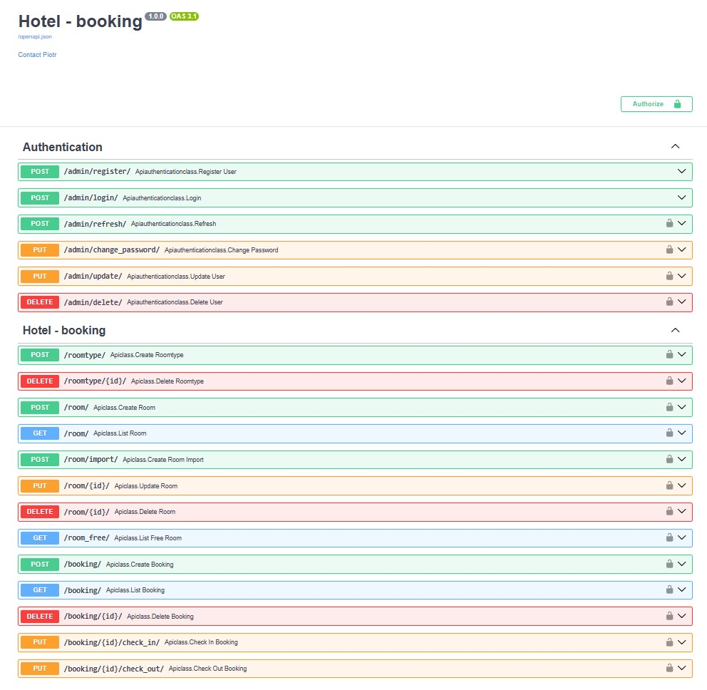

## Table of Contents

* [Project Title](#project-title)
* [Description](#description)
* [Features](#features)
* [Technology](#technology)

# Project Title

Hotel-booking

## Description

Scope of this project is a backend for hotel-booking application.

  

## Features

A few of the things you can do with this application:

* User authentication
* Room management
* Booking of room
* CheckIn & CheckOut
* Searching free rooms

## Technology

* Python 3.12
* FastApi 0.115
* PostgreSQL 17.0
* Redis 7.0
* Nginx 1.27
* Docker-compose 2.29
